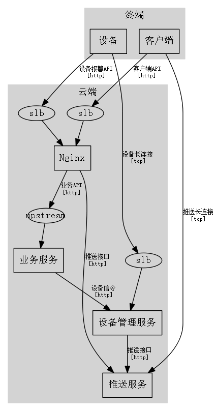

# demo系统架构

### Group 云端 `center`

* [Nginx](cloud/nginx)
* [业务服务](cloud/services)
* [设备管理服务](cloud/devicemgr)
* [推送服务](cloud/pushserver)

### Group 终端 `endpoint`

* [客户端](endpoint/client)
* [设备](endpoint/device)
