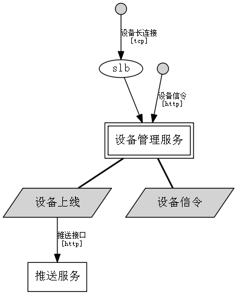

# [demo系统架构](../Home.md) - 设备管理服务

### Action 设备上线

> From 设备长连接 `tcp` `slb`

* Function: 认证设备
* Function: 更新状态
* Interface: [推送接口](../cloud/pushserver.md)

### Action 设备信令

> From 设备信令 `http`

* Function: 向设备发送命令
