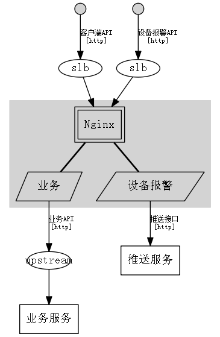

# [demo系统架构](../Home.md) - Nginx

### Action 业务

> From 客户端API `http` `slb`

* Function: 负载均衡
* Function: URL改写
* Interface: [业务API](../cloud/services.md)

### Action 设备报警

> From 设备报警API `http` `slb`

* Interface: [推送接口](../cloud/pushserver.md)
