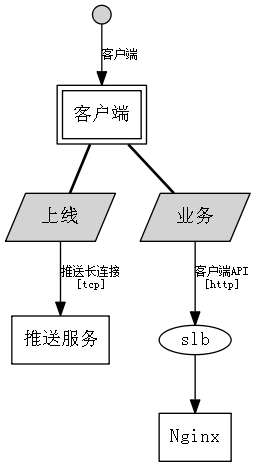

# [demo系统架构](../Home.md) - 客户端

### Action 上线

> From 客户端

* Interface: [推送长连接](../cloud/pushserver.md)

### Action 业务1

> From 客户端

* Interface: [客户端API](../cloud/nginx.md)

### Action 业务2

> From 客户端

* Interface: [客户端API](../cloud/nginx.md)
